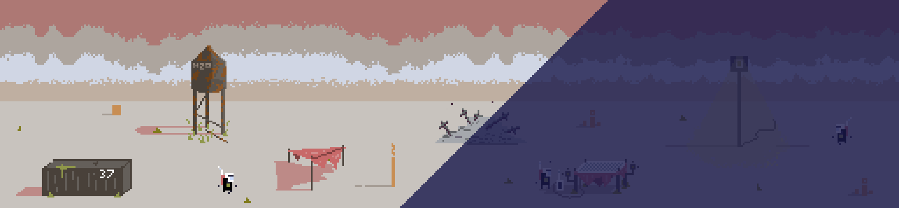

# HeatGame

Play me on [itch.io](https://7am-games.itch.io/heat-game)!

Short and heat game, built in Godot 3.5

This game was made for an art jam with nobodyofwork with the prompt being ‘HEAT’

The inspiration of this game was the abundance and the lack of heat and how to survive a climate that hits on both sides of that scale. This planet has the harsh heat that gets to an uncomfortable 120F and down to -10F. You will succumb to the elements if you don’t use the environment to your advantage. Stay in the shade to keep cool, and at night turn on the heat lamp. The key to success is to manage your time finding, charging, and transporting the batteries to power the terraform machine and the heat lamp. The terraform machine takes 5 full batteries to fully charge. 

## Credits

Art by: [Penusbmic](https://penusbmic.itch.io/)

SFX by:

[Partners In Rhyme](https://partnersinrhyme.com/), [Fesliyan Studios](https://www.fesliyanstudios.com/), and me!

